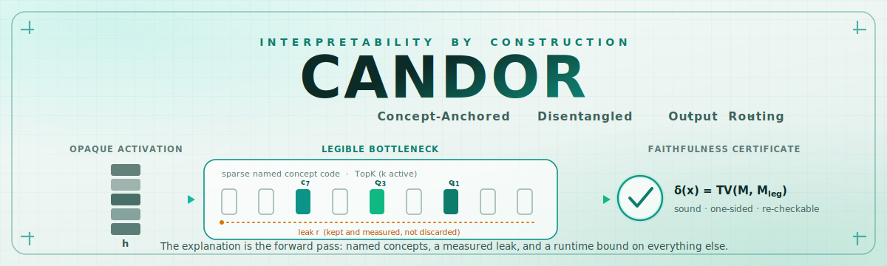

<div align="center">



<br/>

[](pyproject.toml)
[](LICENSE)
[](paper/candor.pdf)
[](tests/)
[](#the-faithfulness-certificate)

**Interpretability by construction: route a layer's computation through a certified Legible
Bottleneck, and emit a runtime bound on everything the named concepts cannot explain.**

*Concept-ANchored · Disentangled · Output · Routing*

</div>

---

For a decade interpretability has been **archaeology**: train an opaque model, then dig
for structure afterwards with probes, sparse autoencoders, and attribution graphs. By
2026 that paradigm is in open crisis. SAEs do not recover canonical features and often
lose to linear probes, attribution graphs leave unbounded computation in "error nodes",
and chain-of-thought is provably an unfaithful, optimization-fragile window. Every one of
these measures faithfulness *after the fact*; none **guarantees** it.

**CANDOR** takes the opposite stance. It makes legibility an **architectural invariant the
model is required to satisfy**, and emits the audit **at inference time**:

- **The Legible Bottleneck.** One composable primitive (to interpretability what
  self-attention is to sequence modelling): read a layer's computation through a sparse,
  typed, persistently-**named** concept code, reconstruct it, and **keep and measure** the
  unexplained remainder (the *leak*) instead of throwing it away.
- **Causal by construction.** The named concepts are co-trained to be *causally
  sufficient* (an interchange / causal-scrubbing objective used as a **training signal**,
  not a post-hoc test), so the explanation is what the model actually computes.
- **A Faithfulness Certificate on every forward pass.** `δ(x)`, the total-variation
  distance between the deployed model and its leak-ablated "legible" twin. It is a
  **measurement, not a learned monitor**, so it is sound by construction (it cannot
  under-report) and **re-checkable by anyone** with one extra forward pass.

> **Thesis.** You do not have to recover interpretability after the fact. You can require
> the architecture to have it, and make the model prove a bound on its own *dark
> computation*, one forward pass at a time.

The paper is at [`paper/candor.pdf`](paper/candor.pdf). **Every reported number is measured
by `experiments/run_all.py` and emitted into the paper automatically. Nothing is
hand-entered.**

## What the experiments show (all measured, on ground-truth tasks)

On synthetic tasks with **known concepts and a known mechanism**, the only setting where
interpretability can be *checked* rather than asserted, CANDOR:

| Property | Result |
|---|---|
| Interpretability tax (legible vs. opaque accuracy) | **none measurable** |
| Faithfulness certificate `δ` (mean) | **≈0.002** (99.9% model/explanation agreement) |
| Concept recovery vs. ground truth | **0.92** (matches a post-hoc SAE) |
| Causal necessity gap (relevant vs. irrelevant ablation) | **≈0.77** |
| Directional causal accuracy (held-out interventions) | **≈0.82** |
| Backdoor (channel-bypass) detection by `δ` | **AUC ≈0.90** |
| Cross-run concept stability (anchored vs. free) | **0.72 vs. 0.00** |

Objective ablations show **every term governs a distinct guarantee**: drop the leak term
and recovery collapses; drop the causal term and the leak regains causal power; drop
anchoring and concept identity stops being stable across runs. *The conjunction is the
contribution.* The Legible Bottleneck also composes with attention on a sequence task.

**Honest real-LLM probe (GPT-2 small).** Retrofitting the channel onto a *frozen* GPT-2
shows the certificate machinery transfers to a real model (δ is measurable by splicing and
running GPT-2), **but a frozen retrofit does *not* favour CANDOR over a reconstruction-only
SAE** (δ 0.11 vs 0.13). I report that honestly because it is the point: CANDOR is
interpretability **by construction**, and its gains come from the model reshaping its
computation through the channel *during training* (Exp 1 and 2), which a frozen retrofit
cannot do. By-construction LLM training is the named next step.

## Quick start

```bash
pip install -e ".[experiments,dev]"

python -m pytest                       # offline unit tests
python demo/quickstart.py              # train a glass-box model, certify it, catch a backdoor
python experiments/run_all.py          # regenerate results/*.json (planted, tax, seq)
python scripts/paper_numbers.py        # results -> paper/_numbers.tex
python scripts/make_figures.py         # results -> paper/figures/*.pdf
make paper                             # compile paper/candor.pdf
```

```python
import candorkit as ck

data  = ck.planted_concepts(task="sum")                         # known ground truth
tr, va = ck.split(data.X.shape[0])
model = ck.LegibleMLP(d_in=data.n_in, d_h=128, n_out=data.n_classes, m=48, k=8)
ck.train_candor(model, data.X, data.y, tr, ck.TrainConfig())

cert = ck.certify(model, data.X[va], data.y[va])                # runtime guarantee
print(cert.delta, cert.agreement)                               # sound, re-checkable
print(cert.active_concepts[0])                                  # the named explanation
```

## What's in the box

| Path | What it is |
|---|---|
| `candorkit/bottleneck.py` | the **Legible Bottleneck** primitive (encode, sparse named code, decode, measured leak) |
| `candorkit/model.py` | CANDOR MLP and Transformer with the three routing modes (full / legible / leak-swap) |
| `candorkit/losses.py` | the conjoined objective: completeness + faithfulness + leak + **causal sufficiency** + anchoring |
| `candorkit/certificate.py` | the **Faithfulness Certificate** `δ(x)` and the named explanation |
| `candorkit/metrics.py` | ground-truth checks: concept recovery, causal necessity, stability |
| `experiments/` | planted concepts, the tax/legibility frontier, a sequence (attention) task |
| `scripts/` | results to paper numbers, results to figures |
| `paper/candor.tex` | the paper, *The Way Toward Interpretable AGI* |

## The Faithfulness Certificate

The deployed model `M` has a twin, the *legible replacement* `M_leg`, obtained by ablating
every leak. Its output is a pure function of the named concept codes. The certificate is
the total-variation distance between them,

```
δ(x) = TV( M(x), M_leg(x) ) ∈ [0, 1]
```

Because `δ(x)` is **computed** by one extra forward pass rather than predicted by a learned
head, it is sound and one-sided: it can never under-report the divergence between the model
and its named-concept explanation, and it cannot be Goodharted into silence. A backdoor
that bypasses the channel has to route through the leak, so it surfaces as a `δ` spike
rather than hiding. A large honest `δ` tells an auditor exactly when *not* to trust the
explanation.

## Honest scope

These are **small-scale demonstrations on synthetic ground truth and a one-layer
Transformer**, *not* a frontier-LLM result. I deliberately chose the regime where soundness
can be **checked**. CANDOR does **not** claim completeness: computation in superposition
guarantees some bypass, so `δ` cannot be driven to zero on arbitrary computation. The
contribution is to make that bypass **measured, bounded, and certified** rather than
unmeasured, and the certificate's value is **soundness, not tightness**: a large honest `δ`
tells you exactly when *not* to trust the named-concept explanation. See the paper's
Limitations section. Every component (sparse named channels, causal-faithfulness training,
concept bottlenecks, sound over-approximation) has precedent; **the novelty is the
conjunction, operating jointly and at runtime.**

## Citing

```bibtex
@misc{debes2026candor,
  title  = {The Way Toward Interpretable AGI: Routing Computation Through
            Certified Legible Bottlenecks},
  author = {Debes, Anwar},
  year   = {2026},
  note   = {Reference implementation, v1.0 (CANDOR)}
}
```

## License

MIT. See [`LICENSE`](LICENSE).
